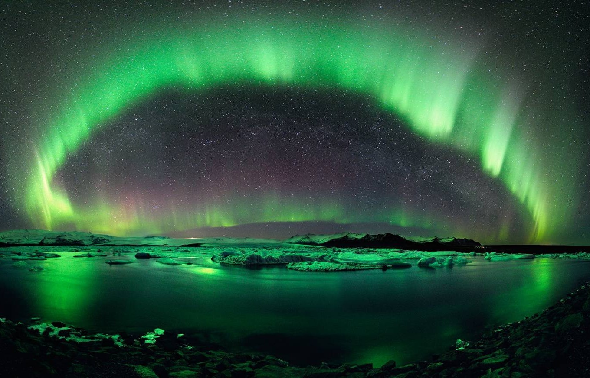
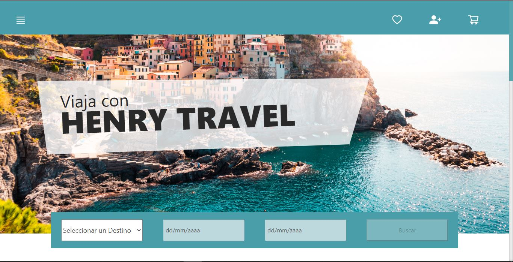
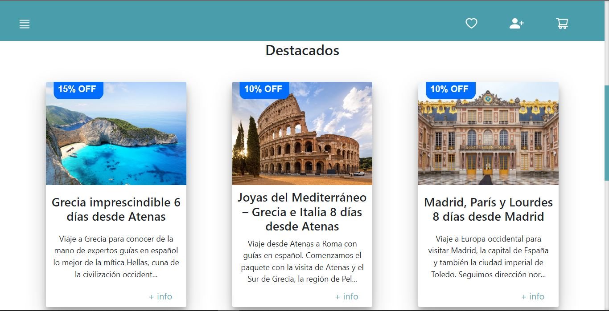

<!-- https://github.com/mruggeroni/mruggeroni/blob/main/ -->

<h2 align="center" >
    Full Stack Developer 💻 with passion 💛 and creativity 🎨
</h2>

&nbsp;

Mi nombre es Matías, y soy 𝐃𝐞𝐬𝐚𝐫𝐫𝐨𝐥𝐥𝐚𝐝𝐨𝐫 𝐅𝐮𝐥𝐥 𝐒𝐭𝐚𝐜𝐤 💻 enfocado en 𝐁𝐚𝐜𝐤-𝐄𝐧𝐝. Estudié 𝘐𝘯𝘨𝘦𝘯𝘪𝘦𝘳𝘪́𝘢 𝘘𝘶𝘪́𝘮𝘪𝘤𝘢 🧪 durante algún tiempo y, estando a pocos exámenes para finalizar, descubrí que no solo me apasiona las matemáticas y resolver problemas desafiantes, sino que además se pueden combinar dentro del enorme mundo de la programación. Por esta razón decidí aventurarme por el desarrollo web para comenzar este nuevo enfoque en mi carrera profesional.

&nbsp;

## ⭐ Languages and Tools:

 

    <code></code>
    <code></code>
    <code></code>
    <code></code>
    <code></code>
    <code></code>
    <code></code>
    <code></code>
    <code></code>
    <code></code>
    <code></code>
    <code></code>
    <code></code>
    <code></code>
    <code></code>
    <code></code>

&nbsp;

## 📌 My proyects:

 

    
    
    

&nbsp;

## 📧 How to reach me:

 

    
    &nbsp;
    

<!--
**mruggeroni/mruggeroni** is a ✨ _special_ ✨ repository because its `README.md` (this file) appears on your GitHub profile.

Here are some ideas to get you started:

- 🔭 I’m currently working on ...
- 🌱 I’m currently learning ...
- 👯 I’m looking to collaborate on ...
- 🤔 I’m looking for help with ...
- 💬 Ask me about ...
- 📫 How to reach me: ...
- 😄 Pronouns: ...
- ⚡ Fun fact: ...
-->
